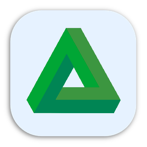

<h1 align="center">Local LLM</h1>

<p align="center">

</p>

> **Personal fork of [andriydruk/LMPlayground](https://github.com/andriydruk/LMPlayground)**, with extra features layered on top of the original app — see [Additions in this fork](#additions-in-this-fork). Full credit for the original goes to [Andriy Druk](https://github.com/andriydruk); like upstream, this fork is MIT-licensed.

Local LLM is an Android application for running Large Language Models locally on-device. Download models, load them in one tap, and chat - all offline, all private. Powered by [llama.cpp](https://github.com/ggml-org/llama.cpp) with GGUF-format models from [Hugging Face](https://huggingface.co/).


## Features

- **On-device inference** - no cloud, no API keys, fully offline
- **Rich markdown** in chat responses - headers, code blocks, lists, and more
- **Reasoning model support** - thinking steps from models like GPT-OSS, DeepSeek R1, and Nemotron are displayed in a styled section
- **Tool calling** - capable models can search the web, fetch a page, and run JavaScript in an on-device sandbox
- **Reliable background downloads** - custom download engine with OkHttp and WorkManager, progress notifications with speed and ETA, automatic resume on network interruptions
- **Storage management** - choose where to keep multi-GB model files with Android's Storage Access Framework
- **ARM optimized** - KleidiAI kernels and OpenMP for faster generation on arm64 devices
- **Large-screen ready** - tablets, foldables, and Chromebooks get a permanent sessions sidebar, list-detail Settings, and freeform window resize support

## Additions in this fork

Features added on top of upstream LM Playground:

- **Message actions** - copy any message, **edit & resend** one of your prompts, or **regenerate** the latest reply (LM Studio-style). Editing or regenerating rebuilds the conversation from that point and re-runs generation.
- **Redesigned reasoning panel** - the model's "thinking" and tool-call details render as collapsible rounded cards with an animated chevron. While the model reasons the card stays live with a running **token count** and a rotating status label (e.g. "Thinking…", localized in English and Italian), and the thinking text itself is rendered as **markdown**.
- **Generation stats** - an optional line under each reply showing total tokens, elapsed time, tokens/second, and **time-to-first-token**. Toggle it in **Settings → Sound, Haptics & Stats**.
- **Context-window meter** - a small circular gauge next to the composer shows how full the model's context window is, from the engine's real KV-cache usage, with a permanent **percentage** beside it (LM Studio-style). The arc shifts color as the window fills; tap the ring to toggle the exact used / total token count.
- **Green rebrand** - a distinct green app icon and the name **"Local LLM"** to tell this fork apart from the original at a glance.
- **One-tap debug builds** - a GitHub Actions workflow builds an installable debug APK on every push and uploads it as an artifact, so a build can be sideloaded without a local Android toolchain.

## Supported Models

| Family | Sizes | Provider |
|--------|-------|----------|
| GPT-OSS | 20B | OpenAI |
| Qwen 3.5 | 0.8B, 2B, 4B | Alibaba |
| Qwen 3 | 0.6B, 1.7B, 4B | Alibaba |
| Gemma 4 | E2B, E4B, 12B | Google |
| Gemma 3n | E2B, E4B | Google |
| Gemma 3 | 1B, 4B | Google |
| Nemotron 3 Nano | 4B | NVIDIA |
| Granite 4.1 | 3B, 8B | IBM |
| Granite 4.0 | Micro, H-Tiny | IBM |
| DeepSeek R1 Distill | 1.5B, 7B | DeepSeek |
| Phi-4 mini | 3.8B | Microsoft |
| LFM2.5 Thinking | 1.2B | Liquid AI |
| Ministral 3 | 3B, 8B (Instruct & Reasoning) | Mistral |
| Llama 3.2 | 1B, 3B | Meta |
| Llama 3.1 | 8B | Meta |

<details>
<summary>Legacy models</summary>

| Family | Sizes | Provider |
|--------|-------|----------|
| Qwen 2.5 | 0.5B, 1.5B | Alibaba |
| Phi 3.5 mini | 3.8B | Microsoft |
| Mistral v0.3 | 7B | Mistral |
| Gemma 2 | 9B | Google |

</details>

Most models use Q4_K_M quantization; Qwen 3.5 uses Q3_K_M, and GPT-OSS ships in its native MXFP4 format. See [`ModelInfoProvider.kt`](app/src/main/java/com/druk/lmplayground/models/ModelInfoProvider.kt) for the full list.

## Install

The original LM Playground is on [Google Play](https://play.google.com/store/apps/details?id=com.druk.lmplayground). **This fork is not published to the Play Store** - build it from source (see below), or download a debug APK from this repository's [GitHub Actions](https://github.com/Leo00703/Local-LLM/actions) artifacts and sideload `app-arm64-v8a-debug.apk` (the build for most phones). The debug build installs alongside the Play Store version.

## Build Instructions

Prerequisites:
* Android Studio [2024.3.1+](https://developer.android.com/studio/releases)
* NDK 27.2.12479018
* CMake 3.31.5

1. Clone the repository with submodules:
```
git clone --recurse-submodules https://github.com/Leo00703/Local-LLM.git
```
2. Open the project in Android Studio: `File` > `Open` > Select the cloned repository.
3. Connect an Android device or start an emulator.
4. Run the application using `Run` > `Run 'app'` or the play button in Android Studio.

Or build the APK from the command line:
```
./gradlew assembleDebug    # output in app/build/outputs/apk/debug/
```

No local toolchain? Push to any branch (or run the **Build Debug APK** workflow from the Actions tab) and download the resulting APK artifact.

## License

This project is licensed under the [MIT License](LICENSE), inherited from upstream LM Playground.

## Acknowledgments

This is a fork of [LM Playground](https://github.com/andriydruk/LMPlayground) by [Andriy Druk](https://github.com/andriydruk), built on [llama.cpp](https://github.com/ggml-org/llama.cpp). Models are GGUF-format (mostly Q4_K_M quantization) sourced from [Hugging Face](https://huggingface.co/).

## Contact

For questions, suggestions, or issues with this fork, please [open an issue](https://github.com/Leo00703/Local-LLM/issues) on this repository.
